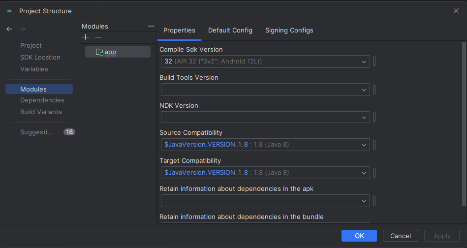
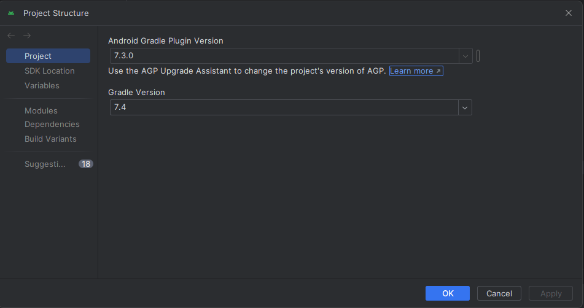

# 软件工程实践项目 Activity_Diary

## 项目简介

TBD

## 项目成员

| 姓名   | 学号        | 专业     | 职务     |
| ------ | ----------- | -------- | -------- |
| 许青阳 | 10215101526 | 软件工程 | 项目经理 |
| 张弛   | 10215101473 | 软件工程 | 前端开发 |
| 漆宇祥 | 10215101549 | 软件工程 | 后端开发 |

## 环境配置

统一一下环境配置，避免出现环境不一致的问题

为了保证和原本项目的兼容，所有环境配置都采取和原项目一模一样

AVD使用API 32，Android 12.0

---
~~jdk 1.8~~

~~java 8~~

Update：需要使用jdk 11，java 11进行编译

---

Android Gradle Plugin Version 7.3.0

Gradle Version 7.4（注意不要更新gradle版本，否则会出现问题）

